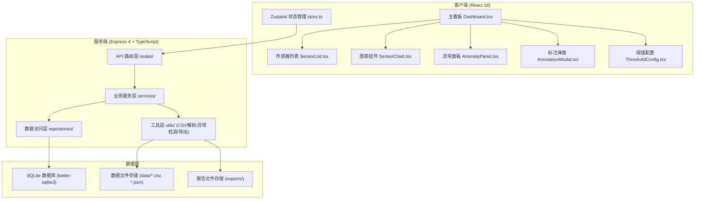
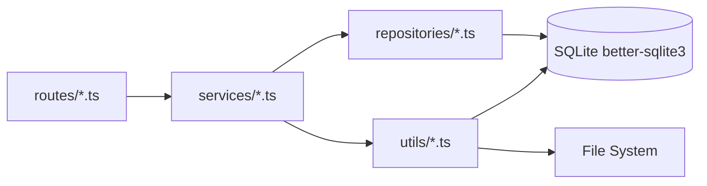
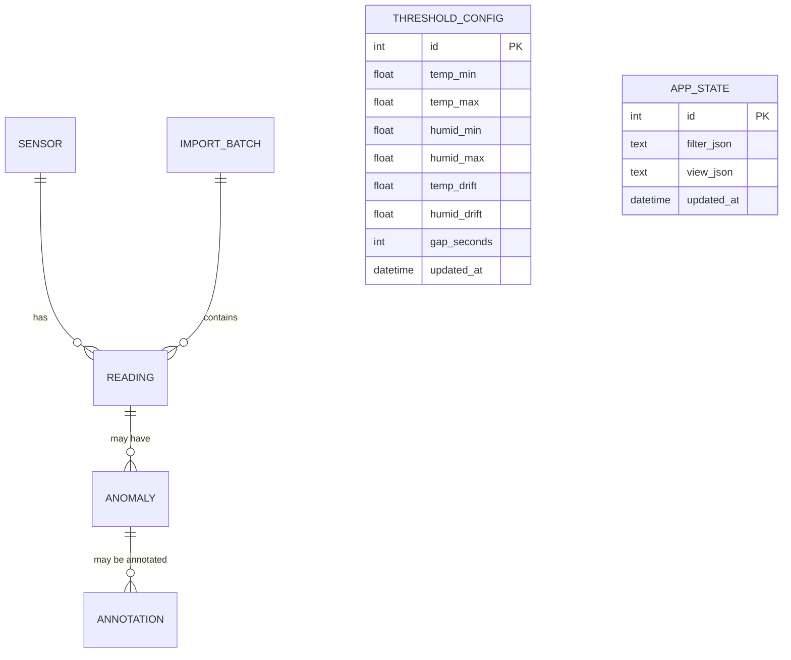

## 1. 架构设计



## 2. 技术描述

- **前端**：React@18 + TypeScript + Vite + TailwindCSS@3 + Zustand + Recharts + Lucide React
- **初始化工具**：vite-init react-express-ts 模板
- **后端**：Express@4 + TypeScript + better-sqlite3（同步SQLite驱动，性能优异）
- **数据库**：SQLite 本地文件 `data/qc_sensors.db`，零配置无需服务端进程
- **文件解析**：papaparse（CSV解析）、原生JSON.parse
- **报告导出**：jspdf（PDF）+ 原生CSV生成
- **样式方案**：TailwindCSS@3 原子化CSS + CSS变量主题系统

## 3. 路由定义

| 路由 | 方法 | 用途 |
|------|------|------|
| `/` | GET | 前端入口页面，Vite serve |
| `/api/sensors` | GET | 获取所有传感器列表（含统计信息） |
| `/api/sensors/:id` | GET | 获取单个传感器详情 |
| `/api/sensors/:id/readings` | GET | 获取传感器读数（支持时间范围查询） |
| `/api/import/sample` | POST | 一键导入内置样例数据 |
| `/api/import/upload` | POST | 上传CSV/JSON文件并导入（multipart/form-data） |
| `/api/import/verify` | POST | 仅校验数据不入库，返回错误详情 |
| `/api/anomalies` | GET | 获取异常列表（支持传感器、状态筛选） |
| `/api/anomalies/detect` | POST | 根据当前阈值重算异常（保护人工结论） |
| `/api/anomalies/:id/annotate` | POST | 对异常进行人工标注 |
| `/api/annotations/rollback` | POST | 回滚最近一次标注 |
| `/api/annotations/history` | GET | 获取标注历史记录 |
| `/api/thresholds` | GET | 获取当前阈值配置 |
| `/api/thresholds` | PUT | 更新阈值配置（触发异常重算） |
| `/api/report/export` | POST | 导出质控报告（PDF/CSV格式） |
| `/api/batches` | GET | 获取导入批次历史（用于重复检测） |
| `/api/state` | GET | 获取完整持久化状态（筛选条件、视图配置等） |
| `/api/state` | PUT | 保存前端状态到后端 |

## 4. API 类型定义

```typescript
// ============ 核心实体 ============
interface Sensor {
  id: string;
  name: string;
  location: string;
  model: string;
  createdAt: string;
}

interface Reading {
  id: string;
  sensorId: string;
  timestamp: string; // ISO 8601
  temperature: number;
  humidity: number;
  batchId: string;
}

type AnomalyType = 'OVER_LIMIT_TEMP' | 'OVER_LIMIT_HUMID' | 'DRIFT_TEMP' | 'DRIFT_HUMID' | 'DATA_GAP';
type AnnotationStatus = 'DETECTED' | 'PENDING' | 'ACCEPTED' | 'FALSE_POSITIVE' | 'RETEST';

interface Anomaly {
  id: string;
  readingId: string;
  sensorId: string;
  type: AnomalyType;
  description: string;
  detectedAt: string;
  thresholdSnapshot: object;
}

interface Annotation {
  id: string;
  anomalyId: string;
  status: AnnotationStatus;
  handler: string;
  reason: string;
  createdAt: string;
  rolledBackAt: string | null;
  rollbackReason: string | null;
}

interface ThresholdConfig {
  tempMin: number;
  tempMax: number;
  humidMin: number;
  humidMax: number;
  tempDriftThreshold: number;   // 相邻读数变化幅度
  humidDriftThreshold: number;
  gapThresholdSeconds: number;  // 时间断点阈值
}

interface ImportBatch {
  id: string;
  fileName: string;
  fileHash: string;
  rowCount: number;
  sensorCount: number;
  importedAt: string;
  errorCount: number;
  errors: ImportError[];
}

interface ImportError {
  row: number;
  field: string;
  value: string;
  message: string;
}

// ============ 请求/响应 ============
interface ImportResponse {
  success: boolean;
  batchId: string;
  totalRows: number;
  validRows: number;
  sensorIds: string[];
  errors: ImportError[];
  duplicateBatch: boolean;
  existingBatchId?: string;
}
```

## 5. 服务端架构



| 层级 | 文件 | 职责 |
|------|------|------|
| 路由层 | `api/routes/sensors.ts` `api/routes/anomalies.ts` `api/routes/import.ts` `api/routes/report.ts` | 参数校验、响应格式化、HTTP状态码 |
| 服务层 | `api/services/ImportService.ts` `api/services/AnomalyDetector.ts` `api/services/AnnotationService.ts` `api/services/ReportService.ts` | 业务逻辑编排、事务处理 |
| 仓储层 | `api/repositories/SensorRepo.ts` `api/repositories/ReadingRepo.ts` `api/repositories/AnomalyRepo.ts` `api/repositories/AnnotationRepo.ts` | SQL操作、CRUD封装 |
| 工具层 | `api/utils/csvParser.ts` `api/utils/fileHash.ts` `api/utils/pdfGenerator.ts` | 纯函数、可独立测试 |

## 6. 数据模型

### 6.1 ER 图



### 6.2 DDL 语句

```sql
-- 传感器表
CREATE TABLE IF NOT EXISTS sensors (
    id TEXT PRIMARY KEY,
    name TEXT NOT NULL,
    location TEXT,
    model TEXT,
    created_at TEXT NOT NULL DEFAULT (datetime('now'))
);

-- 批次表（用于重复导入检测）
CREATE TABLE IF NOT EXISTS import_batches (
    id TEXT PRIMARY KEY,
    file_name TEXT NOT NULL,
    file_hash TEXT NOT NULL UNIQUE,  -- 文件内容哈希，去重关键字段
    row_count INTEGER NOT NULL DEFAULT 0,
    sensor_count INTEGER NOT NULL DEFAULT 0,
    imported_at TEXT NOT NULL DEFAULT (datetime('now')),
    error_count INTEGER NOT NULL DEFAULT 0,
    errors_json TEXT  -- JSON字符串存储错误详情
);

-- 读数表
CREATE TABLE IF NOT EXISTS readings (
    id TEXT PRIMARY KEY,
    sensor_id TEXT NOT NULL REFERENCES sensors(id),
    timestamp TEXT NOT NULL,       -- ISO 8601
    temperature REAL NOT NULL,
    humidity REAL NOT NULL,
    batch_id TEXT NOT NULL REFERENCES import_batches(id),
    raw_row INTEGER
);
CREATE INDEX IF NOT EXISTS idx_readings_sensor_time ON readings(sensor_id, timestamp);
CREATE INDEX IF NOT EXISTS idx_readings_batch ON readings(batch_id);

-- 异常表
CREATE TABLE IF NOT EXISTS anomalies (
    id TEXT PRIMARY KEY,
    reading_id TEXT NOT NULL REFERENCES readings(id),
    sensor_id TEXT NOT NULL REFERENCES sensors(id),
    type TEXT NOT NULL,            -- OVER_LIMIT_TEMP/DRIFT_HUMID/DATA_GAP等
    description TEXT NOT NULL,
    detected_at TEXT NOT NULL DEFAULT (datetime('now')),
    threshold_snapshot TEXT NOT NULL,  -- JSON: 检测时使用的阈值快照
    has_manual_override INTEGER NOT NULL DEFAULT 0  -- 0/1: 是否已人工标注，重算时保护
);
CREATE INDEX IF NOT EXISTS idx_anomalies_sensor ON anomalies(sensor_id);
CREATE INDEX IF NOT EXISTS idx_anomalies_reading ON anomalies(reading_id);

-- 标注表
CREATE TABLE IF NOT EXISTS annotations (
    id TEXT PRIMARY KEY,
    anomaly_id TEXT NOT NULL REFERENCES anomalies(id),
    status TEXT NOT NULL,          -- PENDING/ACCEPTED/FALSE_POSITIVE/RETEST
    handler TEXT NOT NULL,
    reason TEXT NOT NULL,
    created_at TEXT NOT NULL DEFAULT (datetime('now')),
    rolled_back_at TEXT,
    rollback_reason TEXT
);
CREATE INDEX IF NOT EXISTS idx_annotations_anomaly ON annotations(anomaly_id);
CREATE INDEX IF NOT EXISTS idx_annotations_created ON annotations(created_at);

-- 阈值配置表（只有1行，id=1）
CREATE TABLE IF NOT EXISTS threshold_config (
    id INTEGER PRIMARY KEY CHECK (id = 1),
    temp_min REAL NOT NULL DEFAULT 15,
    temp_max REAL NOT NULL DEFAULT 30,
    humid_min REAL NOT NULL DEFAULT 30,
    humid_max REAL NOT NULL DEFAULT 70,
    temp_drift REAL NOT NULL DEFAULT 2,
    humid_drift REAL NOT NULL DEFAULT 10,
    gap_seconds INTEGER NOT NULL DEFAULT 600,
    updated_at TEXT NOT NULL DEFAULT (datetime('now'))
);

-- 前端状态持久化表（筛选条件、视图等，只有1行，id=1）
CREATE TABLE IF NOT EXISTS app_state (
    id INTEGER PRIMARY KEY CHECK (id = 1),
    filter_json TEXT NOT NULL DEFAULT '{}',
    view_json TEXT NOT NULL DEFAULT '{}',
    updated_at TEXT NOT NULL DEFAULT (datetime('now'))
);

-- 初始化默认阈值配置
INSERT OR IGNORE INTO threshold_config (id) VALUES (1);
INSERT OR IGNORE INTO app_state (id, filter_json, view_json) 
VALUES (1, '{"selectedSensorId":null,"statusFilter":"ALL","timeRange":"ALL"}', '{}');
```
