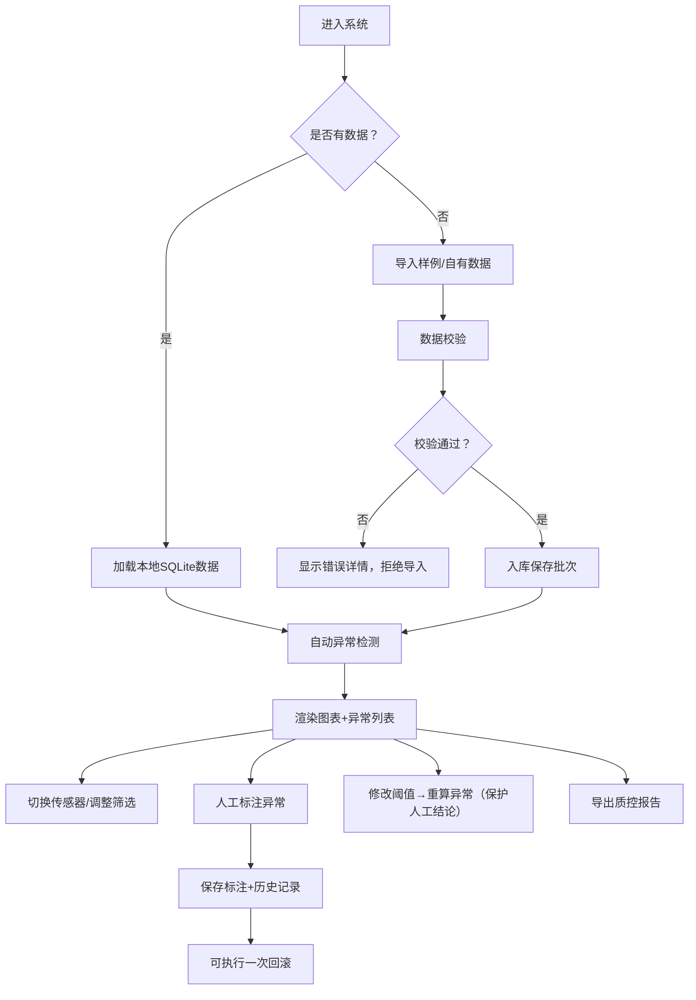

## 1. 产品概述

实验室传感器质控分析看板，用于对多台温湿度传感器设备的读数进行质量控制分析。系统支持批量导入数据、自动异常检测、人工复核标注、回滚操作及报告导出，帮助质控人员高效管理实验室传感器数据质量。
- 目标用户：实验室质控人员、设备管理员
- 核心价值：减少人工巡检成本，建立可追溯的质控流程，保障实验数据可靠性

## 2. 核心功能

### 2.1 用户角色
| 角色 | 注册方式 | 核心权限 |
|------|---------|---------|
| 质控人员 | 本地登录/默认账号 | 导入数据、配置阈值、查看图表、标注异常、回滚操作、导出报告 |

### 2.2 功能模块
1. **数据导入模块**：CSV/JSON文件导入、样例数据一键加载、数据校验（时间戳/数值/重复检测）
2. **传感器管理模块**：设备列表切换、设备信息查看、数据状态统计
3. **阈值配置模块**：漂移阈值、断点阈值（时间间隔）、温湿度越界上下限配置
4. **异常检测模块**：基于规则自动标记异常、阈值修改后重算、人工结论保护
5. **图表看板模块**：时间序列折线图、异常点高亮、时间范围筛选、数据类型切换
6. **人工标注模块**：异常状态修改（待确认/已接受/误报/需复测）、处理人记录、原因备注
7. **回滚模块**：标注历史记录、单步撤销、回滚原因记录
8. **报告导出模块**：PDF/CSV格式报告、异常汇总、标注统计、复核时间线

### 2.3 页面详情
| 页面名称 | 模块名称 | 功能描述 |
|---------|---------|-----------|
| 主看板页 | 顶部导航栏 | Logo、标题、导入按钮、阈值配置、导出报告按钮 |
| 主看板页 | 左侧传感器列表 | 设备卡片、异常计数、在线状态、点击切换当前设备 |
| 主看板页 | 中间图表区 | 双Y轴折线图（温度/湿度）、异常点标记、缩放拖拽、时间筛选 |
| 主看板页 | 右侧异常面板 | 异常列表、状态筛选、标注操作、历史记录、回滚按钮 |
| 主看板页 | 底部状态栏 | 导入批次号、数据总量、异常统计、最近修改时间 |
| 阈值配置弹窗 | 阈值表单 | 温度上下限、湿度上下限、漂移幅度阈值、断点时间间隔阈值 |
| 标注弹窗 | 标注表单 | 状态选择下拉、处理人输入、原因文本域、确认/取消 |
| 回滚确认弹窗 | 回滚信息 | 显示即将撤销的标注详情、回滚原因输入 |

## 3. 核心流程

用户登录后进入主看板，可选择一键加载样例数据或导入自有数据。系统自动对导入数据进行校验（时间戳格式、数值有效性、批次去重），通过后根据当前阈值自动检测异常并标记。用户在左侧切换不同传感器查看数据，在图表上直观看到异常点，右侧面板列出所有异常详情。质控人员点击异常项进行标注（修改状态为待确认/已接受/误报/需复测），填写处理人和原因。如标注错误可执行一次回滚操作撤销。修改阈值后系统自动重算异常，但已有人工结论的记录保持不变。最终用户可导出完整质控报告。

## 4. 用户界面设计

### 4.1 设计风格
- **主色调**：冷色调专业感——深石板青 (#0F172A) 为主背景，科技蓝 (#3B82F6) 为强调色，警戒红 (#EF4444) 标记异常，琥珀色 (#F59E0B) 标记待确认，翠绿 (#10B981) 标记已接受
- **辅助色**：湿度用青色 (#06B6D4)，温度用橙红色 (#F97316)，双色折线图区分
- **按钮样式**：圆角8px，实心主按钮带微妙阴影，次要按钮描边，悬停态轻微上浮+发光
- **字体**：标题用 "Space Grotesk" 半粗体，正文用 "JetBrains Mono" 等宽字体渲染数据和时间戳
- **布局风格**：三栏式卡片布局，玻璃拟态（backdrop-blur）+ 细边框分割，阴影层次分明
- **图标风格**：Lucide 线性图标，尺寸一致 18px，与文字对齐精准

### 4.2 页面设计概述
| 页面名称 | 模块名称 | UI元素 |
|---------|---------|--------|
| 主看板页 | 顶部导航栏 | 深色渐变背景、左侧Logo+标题、右侧操作按钮组、分割线、hover微动画 |
| 主看板页 | 左侧传感器列表 | 垂直滚动卡片、选中态高亮边框+左侧色条、异常计数徽章、脉冲动画提示未处理 |
| 主看板页 | 中间图表区 | 白色卡片容器、图表标题栏（设备名+统计数）、图例、双Y轴、Tooltip悬浮、网格线 |
| 主看板页 | 右侧异常面板 | 标签页切换（全部/待处理/已处理）、异常条目卡片、状态色标标签、操作按钮组 |
| 主看板页 | 底部状态栏 | 半透明浮动条、信息图标+文本、批次号可复制、实时时钟 |
| 阈值配置弹窗 | 模态框 | 居中弹出、半透明遮罩、标题栏、表单网格、数字输入框带步进器、实时预览、保存/取消 |
| 标注弹窗 | 侧滑面板 | 右侧滑入、表单字段、状态选项卡切换、字符计数、提交按钮 |

### 4.3 响应式
- Desktop-first 设计，适配 1440px+ 为主
- 1280px：右侧面板压缩为紧凑模式
- 1024px：左右两栏堆叠，图表占满宽度
- 移动端：垂直堆叠布局，隐藏次要数据

### 4.4 动效设计
- 页面加载：模块按序淡入（stagger 80ms），顶部导航先出现，再三栏同步滑入
- 异常点：脉冲呼吸动画 2s 循环，hover 放大 1.3x
- 标注操作：成功后绿色 checkmark 弹出动画 400ms
- 弹窗：背景遮罩 fade in 150ms，面板 slide + scale 200ms
- 回滚：撤销路径动画 + 状态色块颜色过渡 300ms
